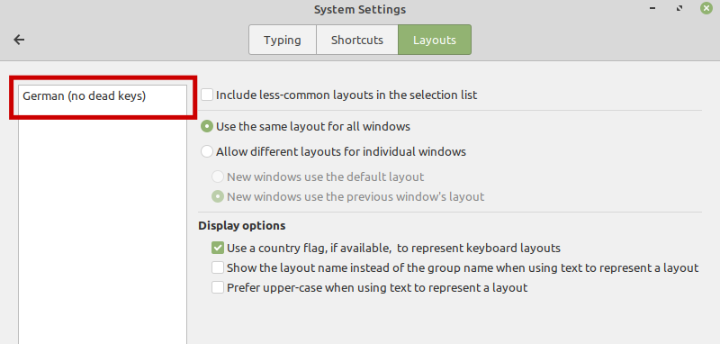
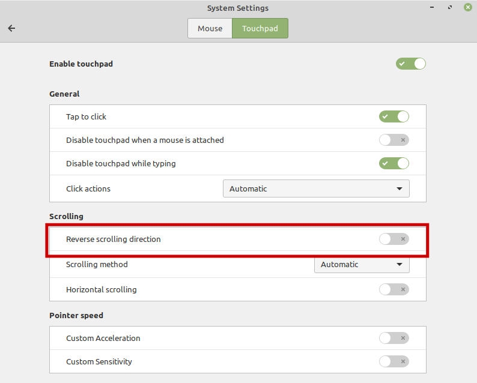
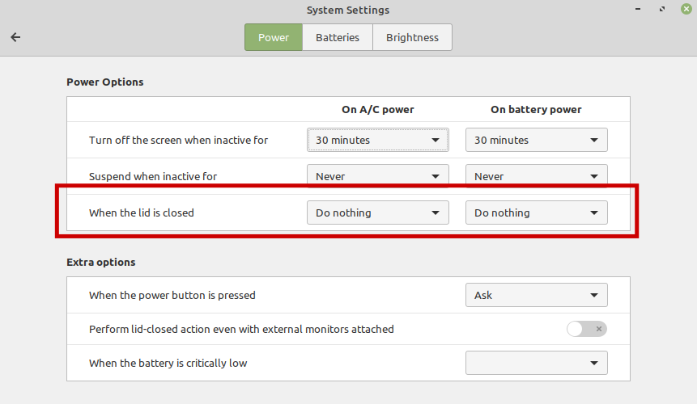
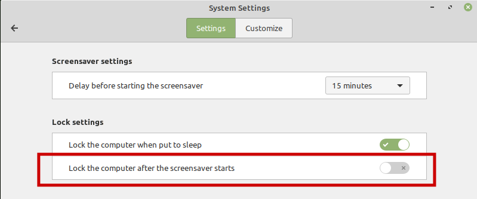
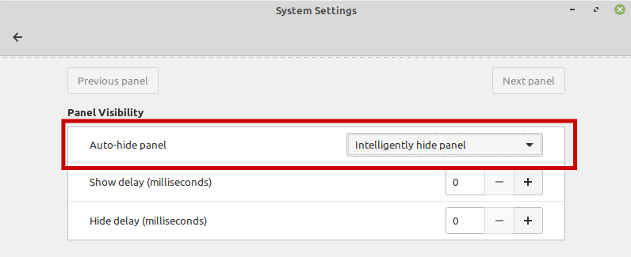

# bootstrap
Simple tooling to bootstrap luphord's dev environment on a new Linux Mint machine.

**This branch is for linuxmint 19.3 only!**

## Usage

### Bootstrap on new machine

```
curl https://raw.githubusercontent.com/luphord/bootstrap/master/bootstrap.sh | bash
```

### View tasks / commands

```
doit list
```

```
clone_repository          Clone a repository into the specified base folder
configure_git             Configure git user and email address
create_conda_env          Create a conda environment
download_miniconda        Download miniconda
install_conda             Install conda
install_nodejs            Install nodejs
install_system_packages   Install required system packages via apt
install_vscode            Install Visual Studio Code
setup_dev_environment     Meta-task for a complete setup of dev environment
setup_docker              Setup docker group
update_conda_env          Update a conda environment
update_repo_env_list      Update config file containing repositories by querying github API
update_repository         Pull changes of the repository from remote source
```

### Pull all repositories

```
git pull && doit update_repository
```

### Update listed repos from GitHub API

```
doit update_repo_env_list
```

## General Configuration

### Select keyboard layout



## Laptop Configuration

### Fix touchpad scrolling direction



### Do not lock when lid is closed



### Do not lock when screensaver starts



### Auto-hide panel


